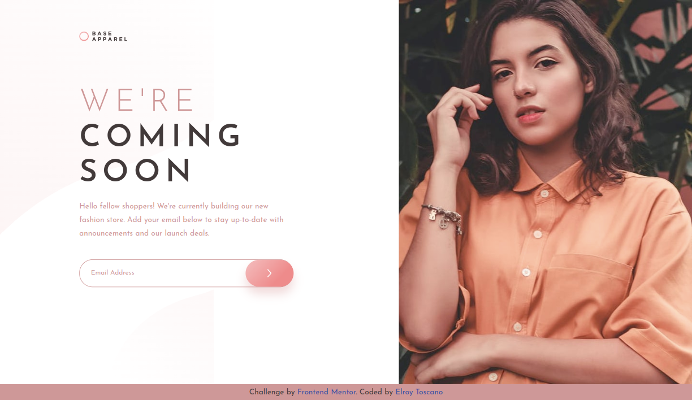

# Frontend Mentor - Base Apparel coming soon page solution

This is a solution to the [Base Apparel coming soon page challenge on Frontend Mentor](https://www.frontendmentor.io/challenges/base-apparel-coming-soon-page-5d46b47f8db8a7063f9331a0).

## Table of contents

- [Frontend Mentor - Base Apparel coming soon page solution](#frontend-mentor---base-apparel-coming-soon-page-solution)
  - [Table of contents](#table-of-contents)
  - [Overview](#overview)
    - [The challenge](#the-challenge)
    - [Screenshots](#screenshots)
    - [Links](#links)
  - [My process](#my-process)
    - [Built with](#built-with)
    - [What I learned](#what-i-learned)
    - [Useful resources](#useful-resources)
  - [Author](#author)
  - [Acknowledgments](#acknowledgments)

## Overview

### The challenge

Users should be able to:

- View the optimal layout for the site depending on their device's screen size
- See hover states for all interactive elements on the page
- Receive an error message when the `form` is submitted if:
  - The `input` field is empty
  - The email address is not formatted correctly

### Screenshots

Desktop design VS Desktop solution 
 

 

Mobile design VS Mobile solution 
 

### Links

- Solution URL: [Frontend Mentor Base Apparell Landing Page Solution URL](https://www.frontendmentor.io/solutions/typescript-webpack-scss-VNOxJQr4Ny)
- Live Site URL: [Frontend Mentor Base Apparell Landing Page Live site](https://fem-base-apparel-landing-page.netlify.app/)

## My process

### Built with

- Semantic HTML5 markup
- CSS custom properties
- Flexbox
- Grid
- SCSS
- Webpack
- Typescript

### What I learned

- How to set up webpack to use it with **Typescript**, **SCSS**, **HTML**.
- Getting to terms with **Typescript** was quite the challenge given the _strict type checking_.

### Useful resources

- [Coder Coder's SCSS Tuts](https://www.youtube.com/c/TheCoderCoder) - The SCSS tuts helped me quite the bit to figure out how to use SCSS optimally whilst styling HTML pages.
- [Brad Traversy's Webpack Course](https://www.youtube.com/watch?v=IZGNcSuwBZs&t=845s) - This small crash course helped me out to setup webpack. Did an additional research to iron out the details.

## Author

- Frontend Mentor - [@elroytoscano](https://www.frontendmentor.io/profile/elroytoscano)

## Acknowledgments

- [This repo](https://github.com/elroytoscano/typescript-webpack) was extensively used for setting up the webpack config.
- [Coder coder's SCSS tuts](https://www.youtube.com/c/TheCoderCoder) were quite useful for SCSS related queries.
